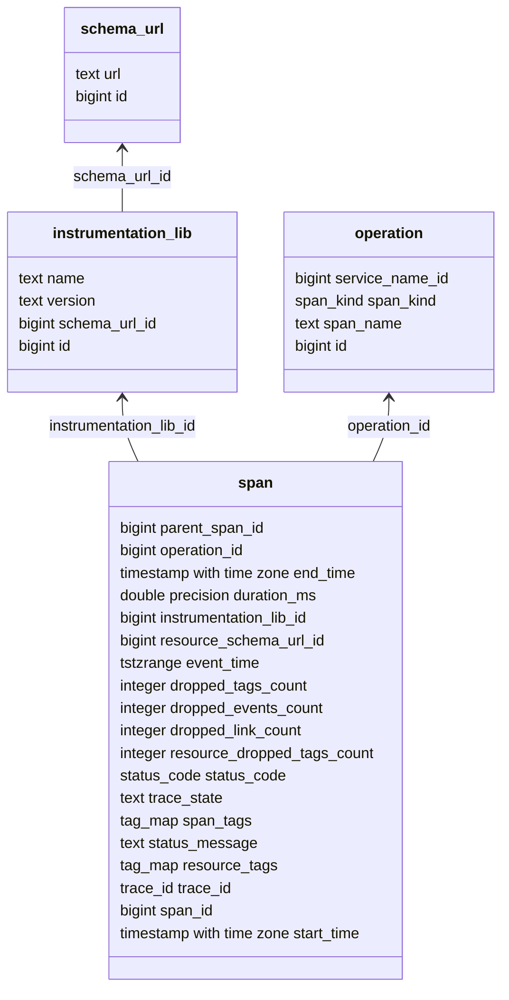

# Tracing tables internals

We expect end-users to interact with the views defined inside `ps_trace` schema.
These views closely match [OpenTelemetry data model](https://opentelemetry.io/docs/concepts/signals/traces/)
and are denormalized for convenience. This document aims to describe the normalized
layout of tables, powering these views. 
(That being said, [view definitions](../migration/idempotent/009-tracing-views.sql) themselves are a good reference.)

## Tag maps

Before we can look closer at the `span`, `event` and `link` tables, we need to
introduce the `tag_map` type and the corresponding `tag` and `tag_key` tables.

It would be unwise to store raw JSON tags with every entry in span or event tables,
so we needed a compact, normalized representation. Take the following set of
tags for example: `{"service.name": "foo", "telemetry.sdk.name": "opentelemetry"}`,
just two standard tags yet they occupy 62 bytes. Enter `tag_key` and `tag` tables.

For each tag key (e.g. `"service.name"` and `"telemetry.sdk.name"` from the
example above) we add a tuple to the `tag_key` table. In our example, `"service.name"` 
is a pre-defined tag key with the `key_id=1`. Then, for each tag, a tuple is added
to the `tag` table, referencing the corresponding `tag_key`. In this example the 
tuple would contain: `key_id=1, key='service.name', value='foo'` and it will be
assigned an `id`, say `114`. Finally, we can replace our raw JSON tag
`{"service.name": "foo"}` with the `{"1": 114}`. And this form is what we store
in `span` and other tables. To denormalize and enable intuitive querying the views 
rely on `_ps_trace`.tag_map_denormalize` which performs lookups and returns a raw
JSON tag map.

The `tag_map` type itself is merely a wrapper around built-in `jsonb`, but some
operators have [`tag_map_rewrite` support function](../src/support.rs) attached
to them. The support function has a detailed comment, but the gist of it is
replacing triplets of `tag_map -> key OP value` in WHERE clauses with
`tag_map @> (SELECT ...)` enabling the use of GIN indexes and precomputing
a set of matching tags in an InitPlan.

Additionally, we maintain `tag_type` bit mask in both `tag_key` and `tag` tables.
It tracks in what context or contexts a given tag is used: `resource`, `span`,
`event` or `link`.

## Span table

The `span` table tracks the OpenTelemetry data model closely, and most fields
match their counterparts in the public `ps_trace.span` view. The attributes of
note are:
- `resource_tags` is a tag map ([see above](#tag-maps))
- `span_tags` is another tag map
- `instrumentation_lib_id` is a foreign key into `instrumentation_lib` table
- similarily `operation_id` references the `operation` table.

The reasoning behind the normalization of `instrumentation_lib` and `operation`
is similar to that of tag maps: we expect the same values to reoccur often
across multiple spans.

## Event and Link tables

The `event` table is joined with the `span` table via `span_id`
and `trace_id` and carries an additional `tags` tag map. It contains
all events for each span.

The `link` table is very similar to the `event`. It also has an additional
`tags` tag map attribute, but joins with the `span` table twice:
- on `span_id` and `trace_id`
- and on `linked_span_id`, `linked_trace_id`.